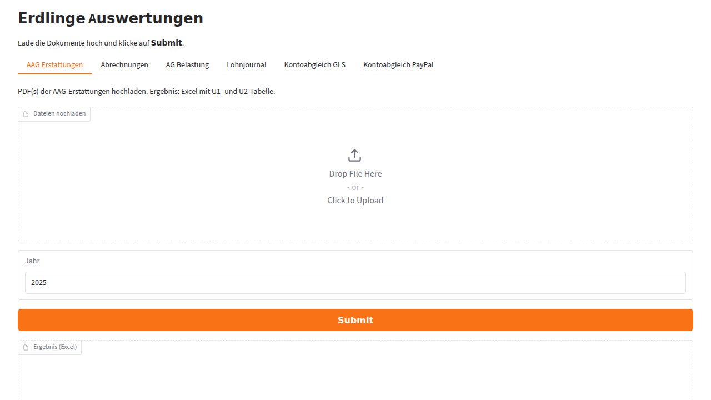
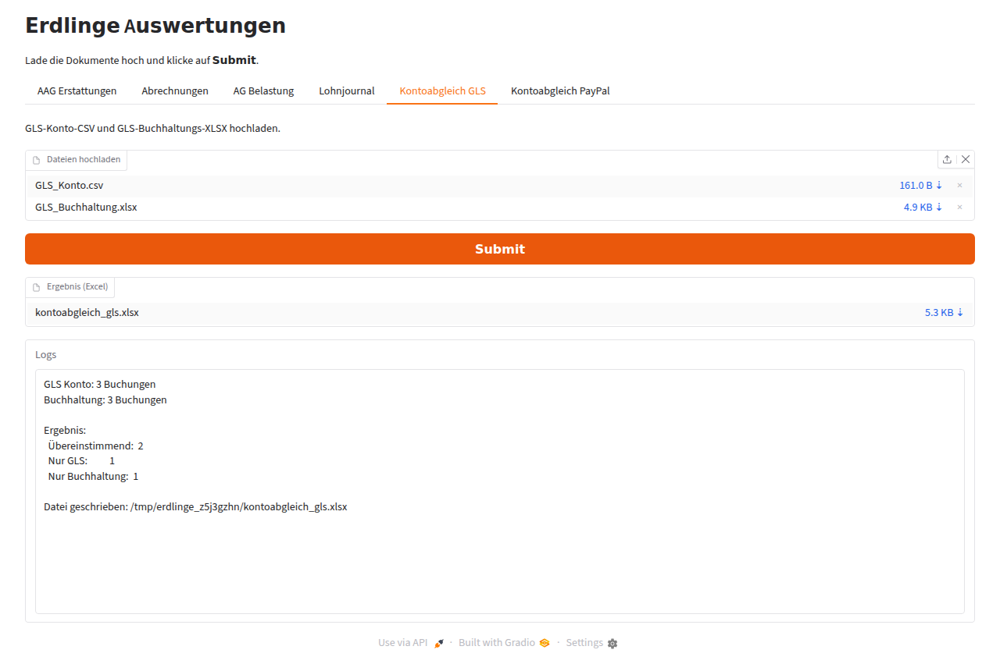

# Erdlinge Auswertungen

Sammlung von Auswertungsskripten für wiederkehrende Buchhaltungs-/Lohn-Aufgaben.
Jedes Skript kann weiterhin direkt über die Kommandozeile genutzt werden **oder**
über die gemeinsame Gradio-Oberfläche (`app.py`).

## Installation

```bash
pip install -r requirements.txt
```

Für die PDF-Skripte wird zusätzlich eine Java-Laufzeitumgebung benötigt
(wird von [`tika`](https://pypi.org/project/tika/) für den Apache-Tika-Server verwendet).

## Gradio-App

```bash
python app.py
```

Die App startet einen lokalen Webserver. Jedes Skript ist ein eigener Tab mit
einem Datei-Upload, einem **Submit**-Button sowie der Ausgabe der Ergebnisdatei
(Excel) und der Log-Ausgabe.

| Tab | Eingabe | Ergebnis |
| --- | --- | --- |
| AAG Erstattungen | PDF(s) | `AAG_Erstattungen.xlsx` |
| Abrechnungen | PDF(s) | `abrechnungen.xlsx` |
| AG Belastung | ein PDF (Dateiname = Monat) | `ag_belastung.xlsx` |
| Lohnjournal | ein PDF | `lohnjournal.xlsx` |
| Kontoabgleich GLS | GLS-Konto-CSV + GLS-Buchhaltungs-XLSX | `kontoabgleich_gls.xlsx` |
| Kontoabgleich PayPal | PayPal-Konto-CSV + PayPal-Buchhaltungs-XLSX | `kontoabgleich_paypal.xlsx` |

## Kommandozeile

Die Skripte erwarten die Eingabedateien in den jeweiligen Unterordnern (wie bisher)
und schreiben die Ergebnisdatei in das aktuelle Verzeichnis:

```bash
python aag_erstattungen.py
python abrechnungen.py
python ag_belastung.py
python lohnjournal.py
python kontoabgleich_gls.py
python kontoabgleich_paypal.py
```

Die Kernlogik der Auswertungen ist unverändert; sie wurde lediglich in eine
`process()`-Funktion gekapselt, die sowohl von der CLI als auch von der Gradio-App
aufgerufen wird. Ergebnisse werden durchgängig als Excel-Dateien ausgegeben.

## Standalone-Programm (Win, Mac, Linux)

Die Anwendung kann mit [PyInstaller](https://pyinstaller.org/) als eigenständige
ausführbare Datei gebündelt werden. Das Bundle startet die Gradio-Oberfläche und
öffnet automatisch den Browser – eine separate Python-Installation ist zur
Nutzung nicht erforderlich. Für die PDF-Auswertungen wird weiterhin eine Java-Laufzeitumgebung benötigt (siehe oben).

```bash
pip install -r requirements-build.txt
pyinstaller --noconfirm erdlinge.spec
```

Das Ergebnis liegt anschließend unter `dist/` (`erdlinge-auswertungen` bzw.
`erdlinge-auswertungen.exe` unter Windows).

Bei jedem Commit auf `main` erzeugt der GitHub-Actions-Workflow
[`.github/workflows/build.yml`](.github/workflows/build.yml) automatisch die
Bundles für Linux, Windows und macOS und stellt sie als Build-Artefakte bereit.

## Screenshots

Übersicht mit allen Tabs:



Beispiel-Lauf des Tabs "Kontoabgleich GLS" (Datei-Upload, Ergebnis-Excel und Logs):



